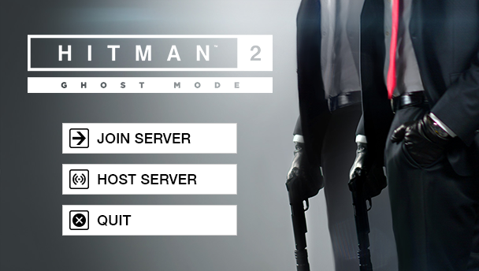

# GMLauncher

GMLauncher is a custom launcher for use with HITMAN 2 and LocalGhost.

It is NOT affiliated with LocalGhost.

 

## Launcher Instructions

1.Download LocalGhost’s "Hitman2Patcher" from: 
https://gitlab.com/grappigegovert/localghost/-/jobs/artifacts/master/download?job=build_patcher

2. Place both “GMLauncher.exe” and "Hitman2Patcher.exe" in the "HITMAN2" folder

**Note:** GMLauncher requires the Microsoft .NET Framework 4.x redistributable package.
 

## Server Instructions

1. Extract the "Server" folder from GMLauncher’s “extras” into the “HITMAN2” folder

2. Install NodeJS (LTS version is recommended): https://nodejs.org/en/download/

3. Download the "LocalGhost" GitLab project from: 
https://gitlab.com/grappigegovert/localghost/-/archive/master/localghost-master.zip

4. Extract the "Server" folder from "localghost-master.zip" into the “HITMAN2” folder 
(example: <Steam folder>\steamapps\common\HITMAN2\Server)

5. Run the "npm install.bat" in the “Server” folder to install all NodeJS dependencies (you can delete the file after)
